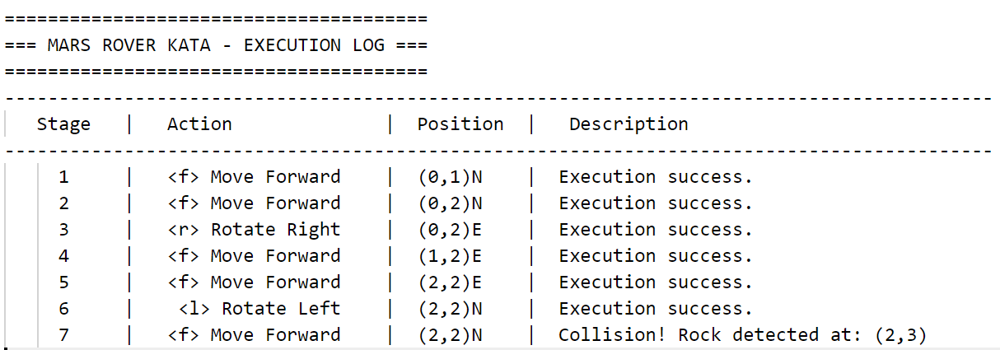

## API ENDPOINTS

First run the Spring Boot application with the following command: 
```
mvn spring-boot:run
```

### List Rovers
  _Receives a request and returns a list of Rovers deployed on Mars._
* **URL:** _/list-rovers_ 
* **Method:** _`GET`_ 
* **Success Response:**
 _The response containing a list of Rovers._
  * **Code:** 200 <br />
    **Content:** 
```json
[
      {
          "id": 1,
          "position": {
              "x": 0,
              "y": 0
          },
          "direction": "NORTH",
          "name": "the_rover_1",
          "running": true,
          "y": 0,
          "x": 0
      },
      {}
  ]
```
* **Sample Call:** _http://localhost:2012/list-rovers_


### Find Rover
  _Receives a request and returns a Rover by a given id._
* **URL:** /rover/{id}
* **Method:** `GET` 
*  **URL Params**
   **Required:** `id=[integer]`
* **Success Response:** 
    _Response that may contain the deployed Rover._
  * **Code:** 200 <br />
    **Content:** 
```json
{
  "id": 1,
  "position": {
      "x": 0,
      "y": 0
  },
  "direction": "NORTH",
  "name": "the_rover_1",
  "running": true,
  "y": 0,
  "x": 0
}
```
* **Sample Call:** _http://localhost:2012/rover/1_

### Execute Rover
  _Executes commands for a specific Rover._
* **URL:** /rover/{id}
* **Method:** `POST` 
*  **URL Params**
   **Required:** 
   `id=[integer]`
* **Data Params:** ```{"commands":"ffrfflf"}```
* **Success Response:** 
    _The log of the command execution._
  * **Code:** 200 <br />
    **Content:** The following table containing the execution logs:

* **Sample Call:** _http://localhost:2012/rover/1_

### Turn on Rover
  _Turns the Rover on._
* **URL:** _/turn-on-rover/{id}_
* **Method:** `GET` 
*  **URL Params**
   **Required:** 
   `id=[integer]` 
* **Success Response:** 
    _The turning on execution log._
  * **Code:** 200 <br />
    **Content:** 
    ```text
    Rover 1 is now running!
    `````
    or if it is already turned on:
    ```text
    Rover 1 is already turned on.
    `````
* **Sample Call:** _http://localhost:2012/turn-on-rover/1_

### Turn off Rover
  _Turns the Rover off._
* **URL:** _/turn-off-rover/{id}_
* **Method:** `GET` 
*  **URL Params**
   **Required:** 
   `id=[integer]` 
* **Success Response:** 
    _The turning off execution log._
  * **Code:** 200 <br />
    **Content:** 
    ```text
    Rover 1 is now stopped!
    `````
    or if it is already turned off:
    ```text
    Rover 1 is already turned off.
    `````
* **Sample Call:** _http://localhost:2012/turn-off-rover/1_

### Deploy Rover
  _Deploys a new Rover to Mars._
* **URL:** /deploy_rover
* **Method:** `POST` 
* **Data Params:** 
```json
{
    "position": {
        "x": 90909,
        "y": 1111
    },
    "direction": "NORTH",
    "name": "the_rover_4",
    "running": false
}
```
* **Success Response:** 
    _The deployed Rover._
  * **Code:** 200 <br />
    **Content:** 
```json
{
    "id": 4,
    "position": {
        "x": 9,
        "y": 1
    },
    "direction": "NORTH",
    "name": "the_rover_4",
    "running": false,
    "y": 1,
    "x": 9
}
```
**Tip**: If Rover has already been deployed, it will update the modified parameters.


